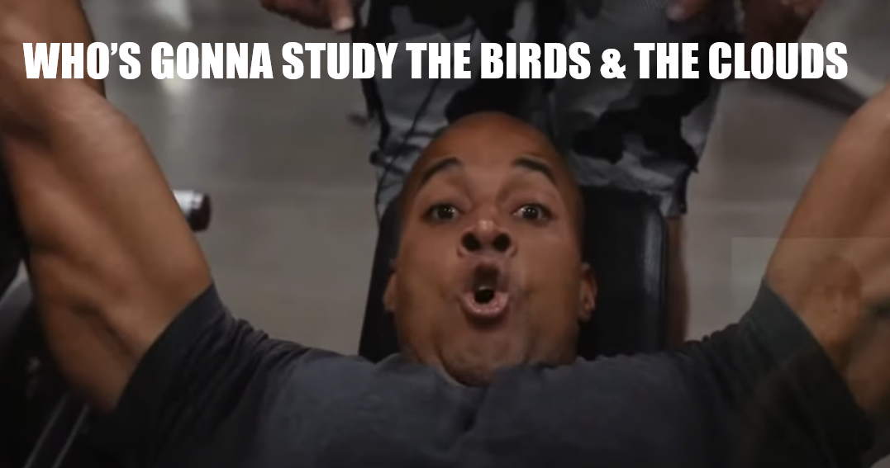

# birdclouds
repo for bird cloud GILBERT X PEASE manuscript

## [Author List Placeholder]

## Abstract

[This is the abstract placeholder]:

## Directory

* [README.md](README.md)
* [repo_management_guide.md](repo_management_guide.md) Guide to working in the [birdclouds](#birdclouds) repo
* [LICENSE](LICENSE) Licensing rights
* [.gitignore](.gitignore) Files to ignore for Git commits

### [Scripts](scripts)

#### [scripts/L0](scripts/L0)

* [This is a placeholder]
* [This is a placeholder]
* [This is a placeholder]

#### [scripts/L1](scripts/L1)

* [This is a placeholder]
* [This is a placeholder]
* [This is a placeholder]

#### [scripts/L2](scripts/L2)

* [This is a placeholder]
* [This is a placeholder]
* [This is a placeholder]

### [Data](data)

#### [data/L0](data/L0)

* [This is a placeholder]
* [This is a placeholder]
* [This is a placeholder]

#### [data/L1](data/L1)

* [This is a placeholder]
* [This is a placeholder]
* [This is a placeholder]

#### [data/L2](data/L2)

* [This is a placeholder]
* [This is a placeholder]
* [This is a placeholder]

### [Results](results)

* [This is a placeholder]
* [This is a placeholder]
* [This is a placeholder]

### [Misc](misc)

* [goggins_meme.png](misc/goggins_meme.png) Self-explanatory