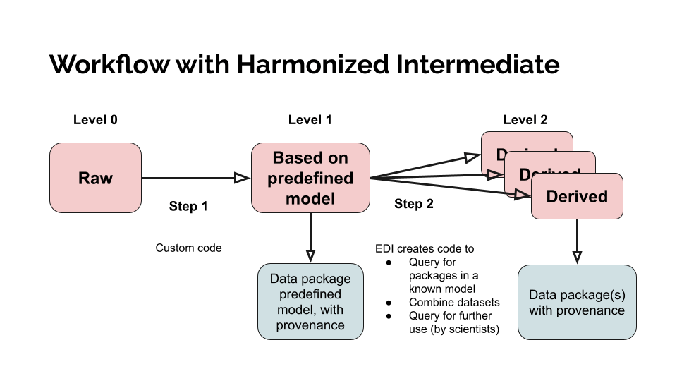

# GitHub Repo Management Guide

If you are part of teams for data prep/pull, analyses 1 or 2, figures 1-4, or you need to work with the project repo, please read below.


### **File naming convention**:

**snake_case**: All files in the GitHub repo should follow the *snake_case* convention:
* all lowercase letters
* spaces between words are joined with an underscore (_)
* > e.g., `my_awesome_script.R`


**organization**: Using [the ALAN repo](https://github.com/BrentPease1/alan/) and [Thematic Standardization from the Environmental Data Initiative](https://edirepository.org/resources/thematic-standardization) as a reference (see image below), files in the [scripts](scripts) and [data](data) directories should be organized into the proper subdirectory and preceded with an ordered numbering system.

* In each of the [scripts](scripts) and [data](data) directories, there are 3 subdirectories: L0, L1, and L2
    * The items in each subdirectory are related to one another.
    * > e.g., A script file preceding with 002 in the scripts directory will connect with the data file preceding with 002 in the data directory

* In the [scripts](scripts) directory,
    * L0 = refers to intial scripts used to create L0 data (if necessary)
    * L1 = refers to scripts used to create L1 data products from L0 data
    * L2 = refers to scripts used to create L2 data products from one or more L1 data products

* In the [data](data) directory,
    * L0 = refers to raw data and metadata files
    * L1 = refers to data products derived from L0
    * L2 = refers to data products derived from L1

* Within each subfolder, file names should be preceded using a 3 digit number, where:
    * The first digit corresponds to the subdirectory Level (0, 1, 2)
    * The second and third digits correspond to the workflow sequence (e.g., 01, 02, 03... 11, 12, 13) that follows the order in which scripts should be executed

See below for an example of the file naming and organization convention.

```
birdclouds/
|-- scripts/
|   |-- L0/
|   |   |-- 001_API_scraper.rmd
|   |   |-- 002_another_scraper.rmd
|   |-- L1/
|   |   |-- 101_API_cleaner.R
|   |   |-- 102_another_cleaner.R
|   |-- L2/
|   |   |-- 201_combined_analysis.rmd
|-- data/
|   |-- L0/
|   |   |-- 001_API_raw.csv
|   |   |-- 002_another_raw.csv
|   |-- L1/
|   |   |-- 101_API_cleaned.csv
|   |   |-- 102_another_raw.csv
|   |-- L2/
|   |   |-- 201_analysis_data.csv
|-- results/.../
```

> The data prep/pull team will primarily use L0 and L1 subdirectories.
> The analysis teams will primarily use L1 and L2 subdirectories.
> The figure teams should use the `results` subdirectory for figures that do not rely on scripts.
> Note that additional Levels can be created if necessary.




### **Pushes/Pulls**

When making Git commits, make sure your commit messages are descriptive

If you add new files to the repo, add them to the directory in the [README.md](README.md/#directory). Karina will help facilitate files descriptions and organization as necessary.

> If you are unfamiliar with Git and GitHub, Brent recommends [happy git with R](https://happygitwithr.com/). Karina is am happy to walk you through set up or explain things further, so *please reach out to Karina if you are new to Git*.


### **File formats**

Determine with your team whether you will use native R scripts (.R), R Markdown (.rmd), or Quarto (.qmd)


### **Coding**

All code should be well-annotated with comments, line spacing, and descriptive variable names


### **TEAMS vs GitHub repo**

Files added to both the GitHub repo and the shared TEAMS <u>**MUST**</u> have matching file names.
    * Not all files added to the GitHub have to be added to the TEAMS.
    * However, if you add a file to GitHub that also exists in TEAMS, the files must share the same file name and extension